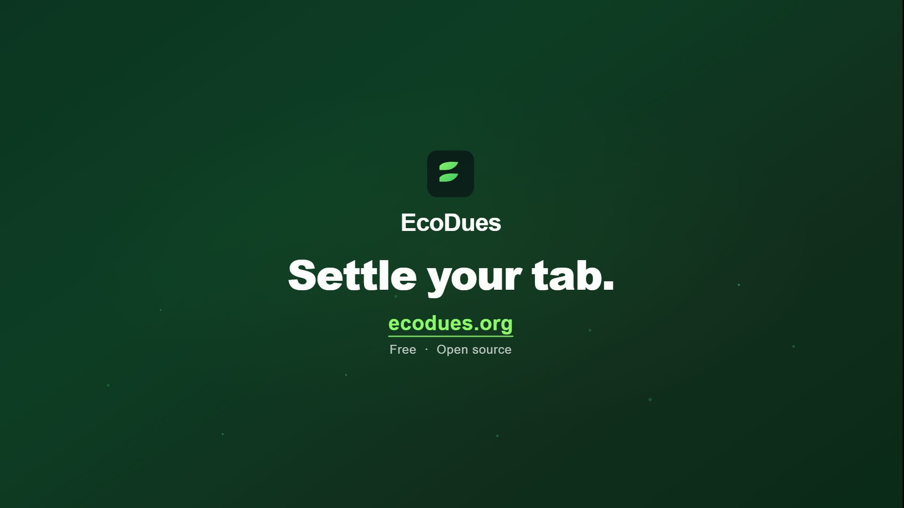

# EcoDues

[](./LICENSE)
[](https://ecodues.org)

**Offset the climate damage of your AI usage.** EcoDues tallies your monthly AI usage across providers, estimates the energy, CO₂e, and social cost it caused using a [published methodology](https://ecodues.org/methodology), and nudges you to donate the offset (at a multiplier you choose) to vetted climate charities — via PayPal Giving Fund or Every.org. EcoDues never touches your money.

Live at **[ecodues.org](https://ecodues.org)**.

[](https://ecodues.org/launch-film.mp4)

<p align="center"><a href="https://ecodues.org/launch-film.mp4">▶&nbsp; Watch the 32-second launch film</a></p>

## How it works

1. **Connect** — link AI providers with an API key (OpenRouter, OpenAI, Anthropic admin keys), pick your subscription tier (ChatGPT Plus, Claude Pro, Copilot, Cursor, …), or log usage manually.
2. **We measure** — on the 1st of each month a cycle runs: usage → kWh → kg CO₂e → damage in USD (social cost of carbon).
3. **You donate** — damage × your multiplier accrues to your tab. When it crosses your charity's minimum, you get a one-click donation link. 100% goes to the charity via PayPal Giving Fund where available.

## Development

```bash
npm install
cp .env.example .env.local   # fill in the required vars (see below)
npm run dev                  # localhost:3000, Turbopack
npm test                     # vitest suite (emissions engine, cycle math, unsubscribe tokens)
npm run build                # production build
npx tsc --noEmit             # type check
npm run lint                 # eslint
```

Set `DEV_MODE=true` in `.env.local` to bypass auth entirely and work with stub data (see `src/lib/dev-mode.ts`). Never set it in production.

### Required environment variables

| Variable | Purpose |
|---|---|
| `NEXT_PUBLIC_SUPABASE_URL` | Supabase project URL |
| `NEXT_PUBLIC_SUPABASE_ANON_KEY` | Supabase anon (public) key for client-side auth |
| `SUPABASE_SERVICE_ROLE_KEY` | Service-role key for crons, webhooks, and admin operations |
| `ENCRYPTION_KEY` | Exactly 64 hex chars (32 bytes); encrypts stored API keys and signs unsubscribe tokens |
| `CRON_SECRET` | Bearer token that protects `/api/cron/*` routes on Vercel |
| `RESEND_API_KEY` | Resend API key for sending donation and recap emails |
| `RESEND_FROM` | Verified sender address (e.g. `EcoDues <notifications@ecodues.org>`) |

Optional: `NEXT_PUBLIC_SITE_URL` (defaults to `https://ecodues.org`), `EVERY_ORG_PARTNER_KEY` (for Every.org Partner API checkout). See `.env.example` for the full list.

## Project structure

```
src/
  app/               # Next.js App Router pages and API routes
  lib/
    emissions/       # Pure emissions engine: constants.ts, models.ts, engine.ts, tiers.ts
    providers/       # Provider connectors: types.ts, openrouter.ts, openai.ts, anthropic.ts,
    │                #   stubs.ts (manual-only), catalog.ts (UI metadata), index.ts (registry)
    actions.ts       # All "use server" mutations (call requireUser() first)
    cycle.ts         # buildCycle() — pure usage → totals; runMonthlyCycleForUser()
    data.ts          # getDashboardData(), getConnections(), leaderboard fetchers
    dev-mode.ts      # Stub data for DEV_MODE=true (no Supabase needed locally)
supabase/
  migrations/        # Sequential .sql files — applied to prod via Supabase MCP
```

## Stack

Next.js 16 (App Router) · Supabase (Postgres + Auth) · Tailwind v4 · Resend (email) · Vercel (hosting + crons)

Architecture notes live in [CLAUDE.md](./CLAUDE.md). Database migrations are in `supabase/migrations/`.

## Transparency

- The full emissions methodology, with cited constants, is at [/methodology](https://ecodues.org/methodology).
- Every user can export all of their data as CSV from the app.
- The emissions engine is pure TypeScript (`src/lib/emissions/`) with a test suite locking in the math.

## Contributing

See [CONTRIBUTING.md](./CONTRIBUTING.md) — provider connectors and methodology improvements are especially welcome.

## License

[MIT](./LICENSE) — Copyright (c) 2026 EcoDues contributors.
